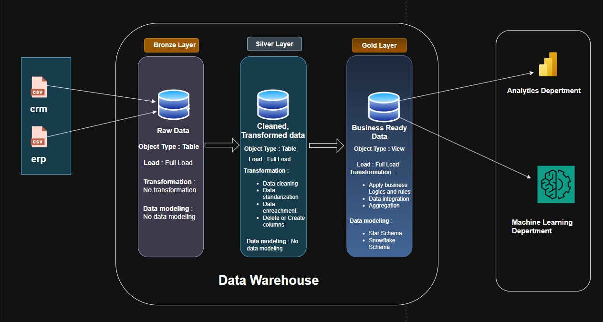

# SQL-Data-Warehouse-and-Analysics-Project
Welcome to the **Data Warehouse and Analytics Project** repository! 🚀  
This project demonstrate the  a comprehensive data warehousing and analytics solution, from building a data warehouse to generating actionable insights. This is a on premis enterprice level data ware house whice can extract the raw data from source and make data ready for analytics and machinelearning.
# Data Architecture
The data architecture for this project follows Medallion Architecture **Bronze**, **Silver**, and **Gold** layers:

**Bronze layer** : In this layer data is extracted from veryous sources like files, DataBases, api's, kafka and so on. But in this project we will extract data from files. No transformation is done only the raw data is avialable.
**Silver layer**: This layer includes data transformation like data cleaning,normalization,column transformation .
**Gold layer**: Houses business-ready data modeled into a star schema required for reporting and analytics.
